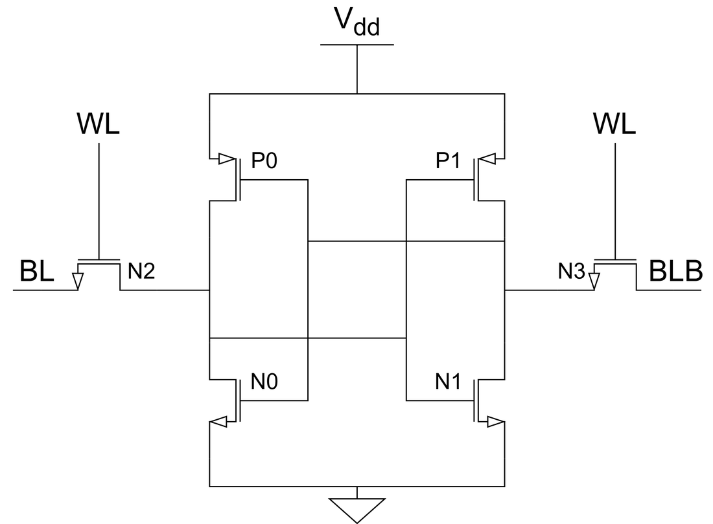
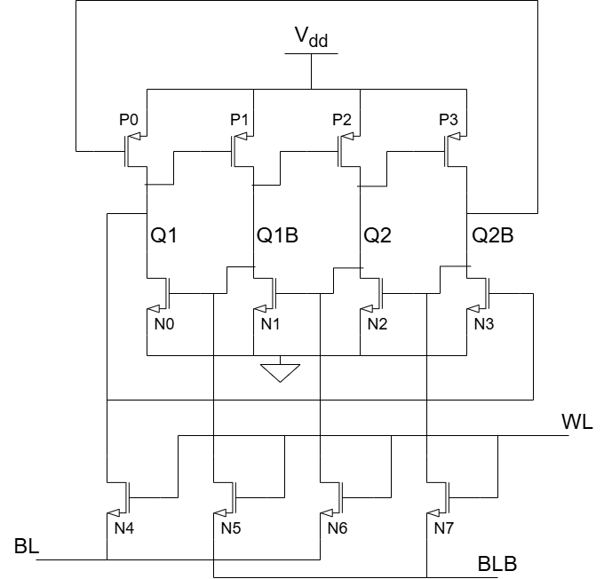
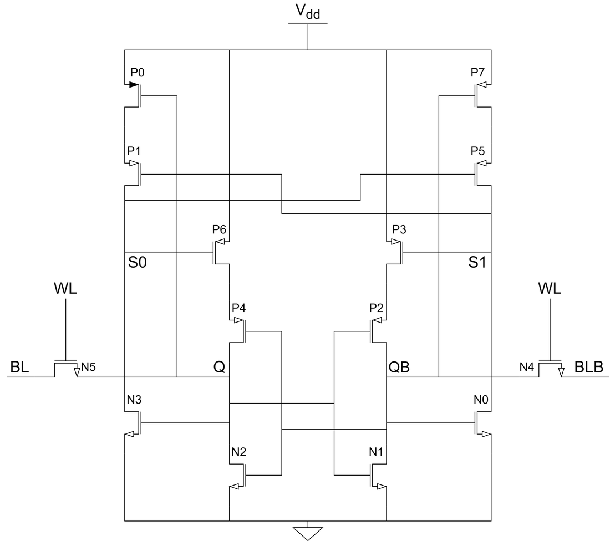
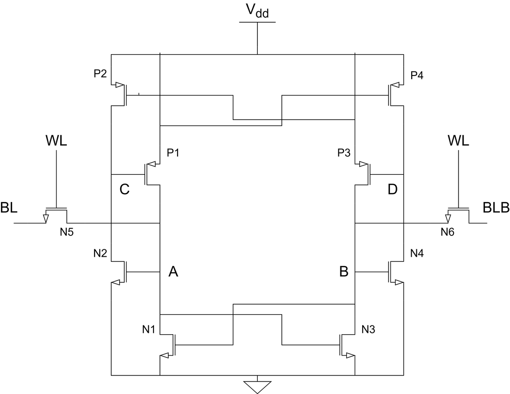
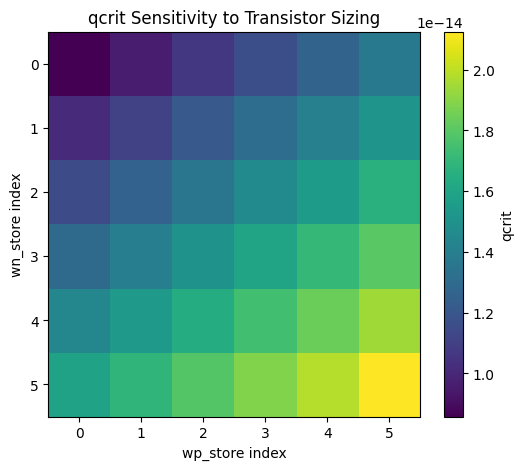
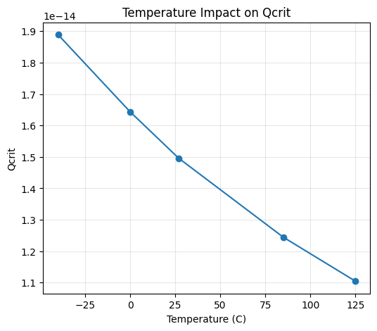
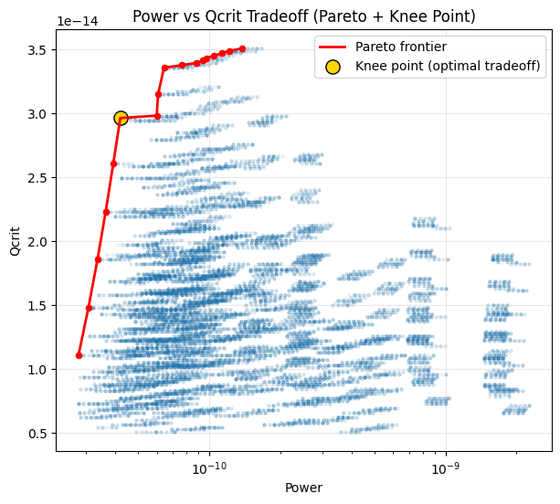

# Radiation-Hardened SRAM Bitcells for Space-Based AI Inference

A SPICE-level evaluation of four SRAM bitcell topologies — the standard **6T**, the **12T DICE**,
the **14T RSP**, and the **10T Quatro** — for use as weight memory in AI inference hardware
operating in low Earth orbit, where a single particle strike can silently flip a stored bit.
Built in Cadence Virtuoso on the GPDK 45 nm process, characterized with 18,000 scripted Spectre
simulations, and analyzed in Python.

📄 **The full paper is in this repository:
[`paper/Evaluation_of_Radiation-Hardened_SRAM_Bitcell_Architectures_for_Space-Based_AI_Inference.pdf`](paper/Evaluation_of_Radiation-Hardened_SRAM_Bitcell_Architectures_for_Space-Based_AI_Inference.pdf)** —
written in IEEE format for ESE 5760 (Semiconductor Memory Design) at the University of Pennsylvania.

---

## At a glance

| | |
|---|---|
| **Process** | Cadence GPDK 045 (45 nm), V<sub>DD</sub> = 1.1 V, T = 27 °C nominal |
| **Tools** | Virtuoso ADE L, Spectre, OCEAN (SKILL) batch scripting, Python |
| **Topologies** | 6T baseline, 12T DICE, 14T RSP, 10T Quatro — schematics and testbenches all included |
| **Metrics** | Critical charge (Q<sub>crit</sub>) under single- and dual-node upset, static noise margin, leakage power, read access time |
| **Scale** | 18,000 scripted simulations across sizing × temperature × supply × process corner; the SEU sweep alone is 9,000 bisection searches ≈ 72,000 Spectre transients |
| **Headline result** | Thermal management in orbital deployment of memory cells will play a critical role in radiation hardening and data integrity |

---

## The problem

Orbital data centers for AI inference are now being announced by SpaceX and NVIDIA. Solar power
is abundant space, but the radiation is not survivable by conventional CMOS without help.
High-energy protons and heavy ions deposit charge on circuit nodes; if the collected charge
exceeds the cell's **critical charge** Q<sub>crit</sub>, the bit flips. For an inference engine a
flipped weight bit is particularly nasty — it corrupts model outputs silently, with no fault
indicator anywhere in the system.

Radiation-hardening-by-design topologies trade transistors for immunity. The question this work
answers is which trade is actually worth making, and the answer turns out to depend on a failure
mode that transistor count alone does not predict.

## The four cells

| | |
|:--:|:--:|
| <br>**6T** — unhardened baseline | <br>**12T DICE** — dual interlocked storage |
| <br>**14T RSP** — 3:1 driver-to-pull-up sizing | <br>**10T Quatro** — selective hardening |

Two cells could not simply be built at minimum size. The RSP cell's pull-down NMOS devices
(N0–N3) need W/L = 360/45 nm for the 3:1 driver ratio its hardening depends on, and the Quatro
cell **fails to write at all** under uniform minimum sizing — its pull-up ratio constraint
(PR₂ ≤ 0.75) forces N2 and N4 up to 240 nm. That asymmetry then shows up directly in the SEU
results, where node D is measurably harder than node B purely because of the sizing needed to
make writes work.

---

## Architecture Comparison Results

Minimum-sized cells at nominal conditions (V<sub>DD</sub> = 1.1 V, 27 °C, TT corner):

| Architecture | Transistors | SNU Q<sub>crit</sub> (fC) | DNU Q<sub>crit</sub> worst (fC) | SNM (mV) | Leakage (pW) | Read t<sub>acc</sub> (ps) |
|---|:--:|:--:|:--:|:--:|:--:|:--:|
| 6T baseline | 6 | 7.38 | — | 370 | 25.4 | 42.4 |
| **12T DICE** | 12 | **immune** | **7.32** | **384** | 53.2 | **25.1** |
| 14T RSP | 14 | **28.33** | 3.77 | 359 | 94.6 | 34.4 |
| 10T Quatro | 10 | 10.44 (B) / 13.01 (D) | 5.03 | 180.5 | 60.2 | 43.9 |

**The dual-node result is the whole story.** Among the cells with a finite single-node critical
charge, the RSP cell wins comfortably — 28.33 fC, a 3.84× improvement on the baseline, behind
only DICE, whose single-node immunity is structural and so has no finite Q<sub>crit</sub> to
beat. But a single particle track at a
45 nm pitch does not politely strike one node. When Q and QB are struck together, the RSP cell's
worst-case Q<sub>crit</sub> collapses to **3.77 fC — below the 7.38 fC of the unhardened 6T cell it
was supposed to improve on**, because both storage nodes share a common pull-down feedback path
and neither can restore the other. Its hardening is real only if the layout physically separates
those two nodes.

The DICE cell behaves differently in kind, not just degree. Single-node injection produced **no
upset anywhere in the 2–50 fC search range**, for every node and both polarities, because each
node has two independent feedback paths correcting it. Its dual-node Q<sub>crit</sub> of
7.32–10.02 fC lands almost exactly on the 6T single-node numbers, which is the theoretically
expected result: in hold mode each DICE node is driven by the same transistor dimensions as the
corresponding 6T node, so per-node restoring strength is the same. Crucially, the vulnerable
pairs are separated by *topology* rather than physical placement — so unlike RSP, DICE's hardening
survives whatever the layout engineer does next. It also read *faster* than the 6T baseline
(25.1 ps vs 42.4 ps), since the interlocked transistors add drive during bitline discharge.

DICE won every evaluated metric and was carried forward for full PVT characterization.

---

## Methodology

**SEU injection.** Strikes are modeled as a double-exponential current source on the struck node
(τ₁ = 10 ps rise, τ₂ = 150 ps fall, I<sub>peak</sub> = Q<sub>inj</sub>/140 ps) — the standard way
to reproduce a particle-strike transient at the circuit level. Every run is in hold mode with the
wordline deasserted and both bitlines precharged, so the access transistors cannot contribute to
the outcome. Initial state is forced with Spectre nodesets, and solver tolerances are tightened
to `reltol=1e-4 / vabstol=1e-7 / iabstol=1e-13` so that results near the flip threshold are
solver-accurate rather than convergence artifacts.

**Q<sub>crit</sub> by bisection, in the simulator.** Rather than sweeping a grid of injected
charges and reading off where the cell flips, each measurement is a binary search implemented in
OCEAN: bracket [2, 50] fC, run a transient, check which side of V<sub>DD</sub>/2 the struck node
ends on at t = 5 ns, halve the interval, repeat 8 times. That converges to ±0.19 fC in 8
simulations where a grid of comparable resolution would need 256. Across the sweep it is the
difference between a tractable run and an intractable one.

**Scale.** A master OCEAN script drives three nested sweeps — SEU, leakage power, SNM — over a
6 × 6 sizing grid × 5 temperatures (−40 to 125 °C) × 5 supply voltages × 5 process corners
(TT/FF/SS/FS/SF), with both storage polarities for SEU. 9,000 + 4,500 + 4,500 = **18,000
simulations**, each appending a row of results to CSV as it completes so a multi-day batch could
be resumed rather than restarted after a failure.

---

## DICE across the PVT space

| | |
|:--:|:--:|
|  |  |
| Q<sub>crit</sub> rises monotonically with both NMOS and PMOS storage width — stronger restoring current, more charge required to flip | Q<sub>crit</sub> degrades steeply from −40 °C to 125 °C as mobility falls and leakage rises |



The Pareto frontier over the full design space is **dominated by cold-corner configurations**,
because low temperature suppresses leakage and strengthens restoring current at the same time.
The knee point — W<sub>n</sub> = 320 nm, W<sub>p</sub> = 120 nm at −40 °C, giving 29.7 fC at
41.9 pW — sits where further Q<sub>crit</sub> costs disproportionate power.

The design conclusion is a system-level one: since sizing alone cannot buy hardness cheaply at
the hot corner, and hardness must be guaranteed at 125 °C, **active thermal management pays twice**
— once in leakage and once in radiation tolerance. That is an argument for spending spacecraft
thermal budget on the memory, not just on the compute.

---

## Repository layout

```
├── paper/         The IEEE-format paper (PDF)
├── cadence/       Virtuoso OpenAccess library — 4 bitcells, 3 periphery cells,
│                  21 testbench cells — plus 28 saved ADE simulation states
├── ocean/         OCEAN batch scripts, in three generations:
│   ├── pvt_sweep/     the final 18,000-simulation study (paper Table I)
│   ├── corner_sweep/  process corners at nominal supply
│   └── nominal_sweep/ TT-corner sizing × temperature
├── analysis/      Jupyter notebook, Python package, and every result CSV
└── docs/figures/  Figures used in this README
```

Each directory has its own README covering how to open, run, or interpret what is in it —
[`cadence/`](cadence/README.md), [`ocean/`](ocean/README.md), [`analysis/`](analysis/README.md).

**To reproduce:** the Cadence side needs Virtuoso with a GPDK045 installation (the PDK is
licensed and not included here) and a `cds.lib` entry pointing at the library; the OCEAN scripts
carry absolute paths from the original Penn compute environment and need retargeting. The Python
side runs standalone against the committed CSVs:

```bash
cd analysis && pip install -r requirements.txt && jupyter lab sram_analysis.ipynb
```

---

## Known limitations

Stated plainly, because they bound what these numbers mean:

- Dual-node injection assumes **simultaneous, equal-magnitude** charge on both nodes — a worst
  case. Real charge sharing depends on track geometry and inter-node spacing, neither of which
  exists at the schematic level.
- No layout, so no extracted parasitics and no physical node separation — which is precisely the
  variable the RSP cell's hardening depends on.
- Read access time uses a fixed 10 fF bitline load with no sense-amplifier model, so it is a
  relative comparison between cells rather than an array-level figure.
- Process variation is covered by corner analysis (TT/FF/SS/FS/SF), not Monte Carlo, so the
  results are point estimates rather than Q<sub>crit</sub> distributions.

---

## Team and my contribution

A three-person project for ESE 5760. Per the paper's contribution statement:

- **John Gannon** (this repo) — implemented and simulated the 12T DICE and 10T Quatro bitcells,
  developed the SEU injection methodology and the OCEAN bisection extraction, scripted and ran
  the full parametric sweep across sizing, supply, temperature, and process corners, and was
  primary author of Sections I–IV.
- **Arnur Maratov** ([@arnurm2004](https://github.com/arnurm2004)) — implemented and simulated
  the 6T baseline and 14T RSP bitcells, ran cross-validation for consistency, extracted SNU and
  DNU critical charge across all node pairs, and measured leakage power and read/write access
  time. Contributed Sections IV–VI.
- **Yoran Wong** ([@scyyw17](https://github.com/scyyw17)) — built the Python post-processing
  workflow: data cleaning, metric extraction, the parametric sweep figures, and the power–
  Q<sub>crit</sub> Pareto and knee-point analysis.

## References

The topologies are reproductions of published designs:

1. T. Calin, M. Nicolaidis, R. Velazco, "Upset hardened memory design for submicron CMOS
   technology," *IEEE Trans. Nucl. Sci.*, vol. 43, no. 6, pp. 2874–2878, 1996. (DICE)
2. S. M. Jahinuzzaman, D. J. Rennie, M. Sachdev, "A soft error tolerant 10T SRAM bit-cell with
   differential read capability," *IEEE Trans. Nucl. Sci.*, vol. 56, no. 4, pp. 2040–2043, 2009. (Quatro)
3. C. Peng et al., "Radiation-hardened 14T SRAM bitcell with speed and power optimized for space
   application," *IEEE Trans. VLSI Syst.*, vol. 27, no. 2, pp. 407–415, 2019. (RSP)
4. P. E. Dodd, L. W. Massengill, "Basic mechanisms and modeling of single-event upset in digital
   microelectronics," *IEEE Trans. Nucl. Sci.*, vol. 50, no. 3, pp. 583–602, 2003.

Documentation drafted with AI assistance; all circuit design, simulations, and analysis is our own.
